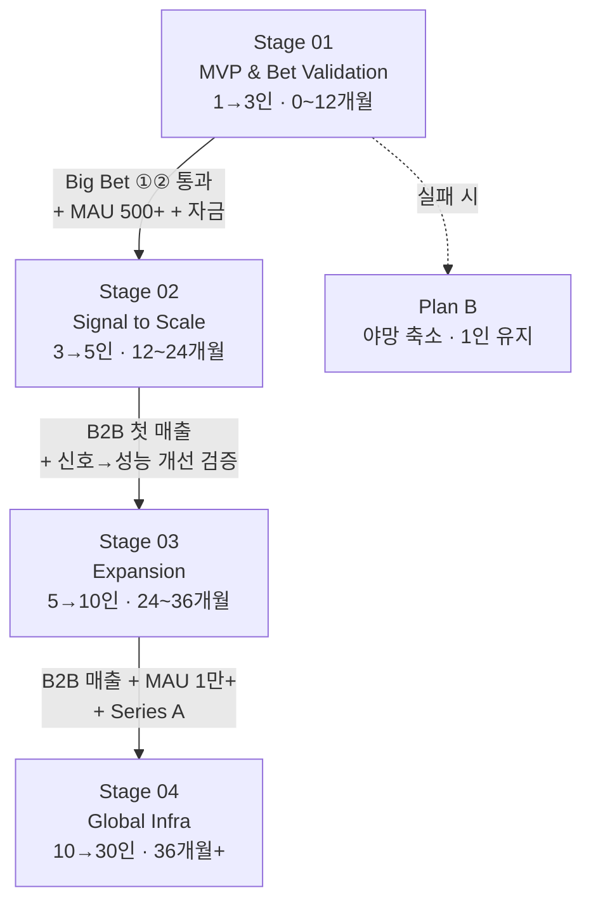

<div align="center">

# NAUM

### 감정 반응 기반 콘텐츠 안전 신호 실험

**5개의 감정 반응 버튼이 콘텐츠 정서 위해성에 대한 의미 있는 신호인지 검증합니다.**

[](#로드맵--5축-기반)
[-yellow)](#팀)
[](#)
[](#)
[](https://nodejs.org)
[](https://react.dev)
[](https://mongodb.com)
[](https://platform.openai.com)

</div>

---

## 프로젝트 소개

**NAUM**은 청소년·일반 사용자를 정치·혐오·폭력·음란 콘텐츠로부터 보호하는 SNS 플랫폼을 **목표로 가설을 검증하는 단계**의 프로젝트입니다.

> 지금은 **사업이 아니라 실험**입니다. NAUM의 모든 야망은 단 하나의 핵심 가설 위에 서 있고, 이 가설이 무너지면 전체가 무너집니다.

### 핵심 가설 (Stage 01의 Big Bet)

> **"사용자의 5개 감정 반응 버튼이 콘텐츠의 정서 위해성에 대한 의미 있는 신호인가?"**

이 질문이 통과해야 ▸ 자체 모델 학습이 의미를 가지고 ▸ Persona AI Parent/Child 파이프라인이 의미를 가지며 ▸ 글로벌 확장이 의미를 가집니다. **검증되지 않은 상태에서 이 모두를 하지 않는 것**이 Stage 01의 규율입니다.

### 왜 NAUM인가

기존 한국어 SNS 모더레이션은 (1) 키워드/룰 기반 필터의 한계, (2) 한국어 맥락·우회 표현 미인식, (3) 청소년 페르소나 데이터의 글로벌 부재(예: NVIDIA Nemotron-Personas-Korea는 19세 이상) 문제를 안고 있습니다. NAUM은 사용자 행동(감정 반응) 자체를 데이터로 누적하여 이 공백을 메우려 합니다.

---

## 핵심 기능

NAUM의 최종 그림은 **4단 Persona AI 파이프라인**이지만, **Stage 01에서는 1~2단만** 구현합니다. 나머지는 가설 통과 후로 미룹니다.

| 단계 | 기능 | Stage 01 | Stage 02 | Stage 03+ |
|------|------|:--------:|:--------:|:---------:|
| **1단** | 작성 시점 콘텐츠 검토 (GPT-4o-mini) | ✅ | ✅ | ✅ |
| **2단** | 등급 분류 (영등위 준용) | ✅ | ✅ | ✅ |
| **3단** | 콘텐츠 기반 추천 (임베딩) | ❌ | ✅ | ✅ |
| **4단** | Persona AI Child 개인화 (LoRA) | ❌ | ✅ | ✅ |
| — | 자체 한국어 모델 사전학습 | ❌ | ❌ | ✅ |
| — | 글로벌 Parent 모델 시딩 | ❌ | ❌ | ✅ |

### Stage 01에서 실제로 구현된/구현 중인 것

- JWT 인증, 게시물·댓글 CRUD, 프로필 시스템 (백엔드 MVP 완료)
- **5개 감정 반응 버튼** — 핵심 데이터 수집 장치
- GPT-4o-mini 기반 한국어 콘텐츠 모더레이션 (temperature=0, 시스템 프롬프트에 예외 케이스 명시)
- React 프론트엔드 핵심 컴포넌트
- 자체 합성 청소년 페르소나 1,000개 (Nemotron 보완용, 예상 비용 ≈ $0.30)

### Stage 01에서 **하지 않는 것** (의도적 포기)

> 야망 리스트만큼 **"안 하는 것" 리스트**가 중요합니다. 이것이 1인(+α) 운영을 살리는 유일한 길입니다.

- ❌ Persona AI 3~4단(추천·개인화) — Stage 02로 미룸
- ❌ B2B SaaS 영업 — Stage 02 후반
- ❌ 글로벌 확장 검토 — Stage 03+
- ❌ 자체 모델 학습 — Stage 04+
- ❌ 댓글 외 사용자 간 상호작용(DM·팔로우) — 운영 부담 방지, **영구 보류 옵션 검토 중**
- ❌ 광고 모델 — 청소년 보호 정체성 보호

### 데이터 흐름

```
[사용자]
   │  ① 콘텐츠 작성
   ▼
[Express API] ──→ [GPT-4o-mini 1단 검토] ──→ [등급 분류 2단] ──→ [게시 허용/차단]
   │
   │  ② 콘텐츠 소비 + 감정 반응
   ▼
[5개 감정 버튼] ──→ [MongoDB 라벨링 저장소]
                              │
                              ▼
                    [신호 품질 분석]  ← Stage 01의 핵심 질문
```

---

## 기술 스택

### Backend


### Frontend


### AI / Data


### 인프라 정책

| 영역 | Stage 01 | Stage 02 | Stage 03+ |
|------|----------|----------|-----------|
| **추론** | GPT-4o-mini API | + 임베딩 모델 | 자체 학습 모델 |
| **GPU** | 없음 (API only) | 임시 클라우드 GPU | FuriosaAI RNGD / H200 검토 |
| **월 API 비용** | **≤ $10 (hard limit)** | < $500 | 사업 매출 기반 |
| **자체 사전학습** | ❌ | ❌ (LoRA만) | ✅ 시작 |

### 기술 의사결정 메모

- **Perspective API → 제외**: 한국어 맥락 인식 한계, 비용·레이턴시 부적합
- **GPT-4o-mini 채택**: 가격 대비 한국어 분류 정확도 우수, 시스템 프롬프트에 예외 케이스 명시
- **AI 전송 텍스트 ≠ DB 저장 텍스트**: 모더레이션 과정의 콘텐츠 변형 방지
- **자체 합성 청소년 페르소나**: Nemotron-Personas-Korea가 19세 이상만 다루므로, GPT-4o-mini로 1,000개 합성하여 글로벌 부재 영역을 NAUM이 선점

---

## 현재 개발 현황

### 구현 진행률 (Stage 01 기준)

```
[✓] JWT 인증 / 게시물·댓글·프로필 CRUD       ████████████████████  100%
[✓] AI 모더레이션 v1 (1~2단)                ████████████████████  100%
[✓] 5개 감정 반응 버튼                       ████████████████████  100%
[✓] React 핵심 컴포넌트                      ████████████████░░░░   80%
[⋯] 자체 합성 청소년 페르소나 1,000개         ████░░░░░░░░░░░░░░░░   20%
[⋯] 신호 품질 분석 파이프라인                  ██░░░░░░░░░░░░░░░░░░   10%
[ ] 베타 사용자 50~100명 모집                ░░░░░░░░░░░░░░░░░░░░    0%
[ ] CI/CD                                  ░░░░░░░░░░░░░░░░░░░░    0%
```

### Stage 01 KPI (12개월 후 측정)

| 지표 | 목표 | 의미 |
|------|------|------|
| 베타 사용자 (수도권 대학·고등학교) | 50~100명 | 신호 수집 최소 모집단 |
| 누적 감정 반응 데이터 | 1만~5만 건 | 통계적 분석 가능 임계점 |
| 신호 품질 분석 | "불편 버튼 ↔ 유해 콘텐츠" 상관관계 검증 | **Big Bet ① 통과 여부** |
| 자체 합성 페르소나 | 1,000개 | 청소년 페르소나 자산 선점 |
| CMK 매칭 후 유지 인원 | 1명 이상 | **Big Bet ② 통과 여부** |

---

## 목표

NAUM은 단계별 가설 통과를 조건으로 진화합니다. **다음 단계는 이전 단계의 Big Bet이 통과해야만 의미를 가집니다.**

### Stage 01 — 신호 검증 (지금)
**감정 반응이 진짜 신호인가? 그리고 함께할 사람을 만나는가?**

### Stage 02 — Signal to Scale
신호가 검증되면 ▸ Persona AI Child 모델 작동 + B2B 첫 매출 + 학교·청소년 기관 파일럿.

### Stage 03 — Expansion
B2B 매출이 발생하면 ▸ 자체 한국어 모델 학습 + 일본·동남아 Parent 모델 시딩.

### Stage 04 — Global Infrastructure
한국에서 검증된 파이프라인이 글로벌에서 작동하면 ▸ 국가별 Parent 모델 API 사업화.

---

## 팀

### 현재 상태 — 1인 운영, CMK 매칭 진행 중

NAUM은 풀스택 개발자이자 창업자인 **Jun**이 **학업과 병행하여 주 20~30시간** commit으로 운영하는 1인 프로젝트입니다. 2025년 7월 **CMK 캠퍼스프러너 팀빌딩** 매칭을 통해 3인 체제로 발전하는 것을 목표로 하고 있습니다.

### 12개월 후 목표 구성

| 역할 | 인원 | 상태 | 합류 경로 |
|------|------|------|----------|
| **창업자 / 풀스택** | 1 | ✅ 본인 | — |
| **AI 엔지니어** | 1 | 🔍 매칭 중 | CMK 7월 매칭 → 8월 해커톤 → 8~10월 멘토링 |
| **UI/UX 디자이너** | 1 | 🔍 매칭 중 | CMK 7월 매칭 → 8월 해커톤 → 8~10월 멘토링 |

> **현실 직시**: 팀원도 학업 병행 학생일 가능성이 높습니다. 3인이지만 총 commit 시간은 약 **60~90시간/주 ≒ 풀타임 1.5~2명 분 작업량**입니다. 평가자에게는 3인이지만, 내부 계획은 이 작업량을 기준으로 합니다.

### 매칭 실패 대비 Plan B *(내부용 — 사업계획서엔 명시하지 않음)*

| 매칭 결과 | 대응 |
|-----------|------|
| **0명 매칭** | 1인 유지, 야망 축소 (4단→1~2단, 100명→50명), 12개월 끝 자력 채용 시도 |
| **1명 매칭** | AI 엔지니어 우선 영입. 디자이너 부재는 본인이 임시 커버 (NAUM 톤 이미 정의됨) |
| **2명 매칭** | 원래 계획 진행 |

### 합류하면 좋은 사람

- 한국어 AI · 청소년 콘텐츠 안전 문제에 진심인 분
- 초기 단계의 불확실성과 빠른 의사결정을 즐기는 분
- "검증되지 않은 야망은 다음 단계로 미룬다"는 규율에 동의하는 분

📬 **연락**: `yclove09@gmail.com`

---

## 로드맵 — 5축 기반

각 Stage는 **Stage · Team size · Current focus · Big bets · Constraints** 5축으로 점검됩니다.

### Stage 01 — MVP & Bet Validation *(0~12개월)*

| 축 | 내용 |
|---|---|
| **Stage** | MVP 구축 + 핵심 가설 검증. **실험과 학습이 본업.** |
| **Team size** | 1인 → 3인 (CMK 매칭 의존) |
| **Current focus** | "5개 감정 반응 버튼이 정서 위해성의 의미 있는 신호인가" 검증. **다른 모든 야망은 이 검증 뒤로.** |
| **Big bets** | ① 감정 반응이 진짜 신호다 (기술 가설) ② CMK에서 함께할 사람을 만난다 (조직 가설) |
| **Constraints** | 학업 병행 · 주 20~30h · 1인 풀스택 출발 · **API $10/월 hard limit** · Nemotron 19+ 한계 · 베타 사용자 0명 출발 |

**진입 조건 → Stage 02**
- [ ] 감정 반응 신호 품질 검증 완료 (Big Bet ①)
- [ ] MAU 500+
- [ ] CMK 후에도 팀원 1명 이상 유지 (Big Bet ②)
- [ ] Seed 또는 초기창업패키지 자금 단서

---

### Stage 02 — Signal to Scale *(12~24개월)*

| 축 | 내용 |
|---|---|
| **Stage** | 가설 통과 후 본격 확장. **이제 사업이다.** |
| **Team size** | 3 → 5인. 풀타임 전환 인력 1~2명 등장 가능 |
| **Current focus** | Persona AI Child 모델 작동 + B2B 첫 매출 |
| **Big bets** | ① 감정 반응 데이터가 모더레이션 성능을 실제로 개선하는가 ② 학교·청소년 기관이 NAUM에 돈을 낸다 |
| **Constraints** | 자체 사전학습 인프라 자금 부족 → 임베딩 + LoRA fine-tuning만 |

**하는 것**: 4단 파이프라인 완성, Parent 모델 LoRA fine-tuning, MAU 1,000~5,000, 학교·기관 인터뷰 10곳 → 파일럿 1~2곳, 누적 데이터 100만~1천만 건
**안 하는 것**: 자체 모델 사전학습, 글로벌 진출, B2C Persona AI 구독

---

### Stage 03 — Expansion *(24~36개월)*

| 축 | 내용 |
|---|---|
| **Stage** | 검증된 모델의 본격 확장 + 자체 모델 학습 시작 |
| **Team size** | 5 → 15인. 인프라/AI 팀 형성 |
| **Current focus** | 자체 한국어 모델 학습 + 일본·동남아 진출 검증 |
| **Big bets** | 검증된 Parent/Child 파이프라인이 다른 국가에서도 작동하는가 (지역 일반화) |
| **Constraints** | GPU 인프라 비용 — 클라우드 vs FuriosaAI RNGD 검토. **Series A 자금 전제.** |

**하는 것**: 자체 한국어 모델 학습, B2C Persona AI 구독 출시, 일본·동남아 Parent 모델 시딩, 한국어 정서 데이터 API 라이선싱
**안 하는 것**: 미국·EU 본격 진출, **Frontier 모델 경쟁** (NAUM은 페르소나 특화 포지셔닝 유지)

**진입 조건 → Stage 04**: B2B 매출 발생 / MAU 10,000+ / 누적 데이터 1천만 건+ / TIPS·Series A 자금

---

### Stage 04 — Global Infrastructure *(36개월+)*

| 축 | 내용 |
|---|---|
| **Stage** | 글로벌 페르소나 AI 인프라 회사로 진화 |
| **Team size** | 30 → 100인. 다국가 운영 조직 |
| **Current focus** | 국가별 Parent 모델 API 사업화 |
| **Big bets** | 한국에서 검증된 파이프라인이 글로벌 표준이 된다 |
| **Constraints** | 각국 규제·문화 차이 — 현지 파트너십 필수 |

---

### Stage 흐름 도식



---

## 핵심 통찰 — 이 로드맵의 정직함

1. **Stage 01은 "사업"이 아니라 "실험"이다.** 큰 그림은 그리되, Stage 01에서는 단 하나의 핵심 가설 검증에 집중한다.
2. **Team size는 commit 시간의 환상을 만들지 않는다.** 3인 ≒ 풀타임 1.5~2명 분.
3. **CMK는 무료 채용 기회이지만 보장은 없다.** Plan B를 머릿속에 두고 Stage 01을 살아낸다.
4. **"안 하는 것" 리스트가 야망 리스트만큼 중요하다.** 이것이 1인(+α) 운영을 살리는 유일한 길.

---

## 평가자/투자자용 한 단락 요약

> NAUMSOFT의 Stage 01(0~12개월)은 한 가지 핵심 가설 — **"사용자의 감정 반응이 콘텐츠 정서 위해성을 판별하는 의미 있는 신호인가"** — 의 검증에 집중합니다. CMK 캠퍼스프러너 팀빌딩을 통해 AI 엔지니어와 UI/UX 디자이너를 영입하여 12개월 끝에 3인 체제로 발전하며, 베타 사용자 50~100명을 통해 누적 1~5만 건의 감정 반응 데이터를 확보합니다. 동시에 NVIDIA Nemotron-Personas-Korea(19세 이상)를 보완하기 위해 자체 합성 청소년 페르소나 1,000개를 구축하여, **글로벌에 부재한 청소년 페르소나 데이터 자산을 NAUM이 가장 먼저 보유**합니다. Stage 02 이후는 검증된 가설을 바탕으로 단계적 확장하며, Stage 04에서 글로벌 페르소나 AI 인프라로 진화합니다.

---

<div align="center">

**NAUM** · 검증되지 않은 야망은 다음 단계로 미룬다

Made with ☕ in Korea — Stage 01 / 1인 (CMK 매칭 중)

</div>