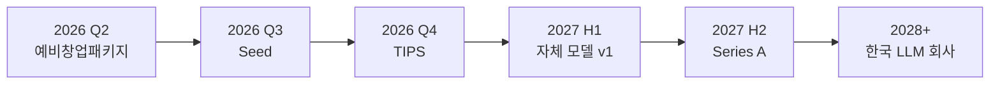

<div align="center">

# NAUM

### 감정 기반 AI 콘텐츠 안전 플랫폼

**리액션 버튼으로 학습 데이터를 모으고, 실시간으로 유해 콘텐츠를 차단합니다.**

[](https://github.com/)
[](LICENSE)
[](https://nodejs.org)
[](https://react.dev)
[](https://mongodb.com)
[](https://platform.openai.com)
[](https://www.k-startup.go.kr)

</div>

---

## 프로젝트 소개

**NAUM**은 SNS 환경에서 정치적·혐오·폭력·음란 콘텐츠로부터 청소년과 일반 사용자를 보호하기 위한 **감정 기반 AI 콘텐츠 안전 플랫폼**입니다.

기존의 단순 키워드 필터링과 사후 신고 방식은 한국어의 맥락적 욕설과 우회 표현을 잡지 못합니다. NAUM은 두 가지 축으로 이 문제를 풉니다.

1. **실시간 AI 모더레이션** — GPT-4o-mini 기반의 한국어 특화 시스템 프롬프트로 게시 직전 콘텐츠를 검수합니다.
2. **감정 리액션 버튼** — 사용자가 콘텐츠에 대한 감정을 표시하는 행동 자체가 양질의 한국어 라벨링 데이터로 누적되어, 자체 모델 학습의 기반이 됩니다.

> 단순히 콘텐츠를 차단하는 것을 넘어, **사용자 참여 → 데이터 축적 → 모델 고도화**의 선순환을 만들어내는 것이 NAUM의 핵심 차별점입니다.

---

## 핵심 기능

| 기능 | 설명 | 상태 |
|------|------|------|
| **JWT 기반 인증** | 회원가입 / 로그인 / 토큰 갱신 | 구현 완료 |
| **게시물 CRUD** | 작성·조회·수정·삭제, 이미지 업로드 (Multer) | 구현 완료 |
| **AI 콘텐츠 모더레이션** | GPT-4o-mini로 게시 전 유해성 검수, 차단 사유 반환 | 구현 완료 |
| **감정 리액션 시스템** | 다중 감정 버튼 → 라벨링 데이터 자동 수집 | 구현 완료 |
| **댓글 시스템** | 댓글 작성·삭제, 댓글에도 모더레이션 적용 | 구현 완료 |
| **프로필 시스템** | 프로필 이미지, 자기소개, 활동 이력 | 구현 완료 |
| **신고 / 차단 큐** | 사용자 신고 → 운영자 검토 워크플로 | 설계 단계 |
| **청소년 보호 모드** | 연령 인증 기반 강화 필터링 | 설계 단계 |
| **자체 한국어 분류 모델** | 누적된 리액션 데이터로 LoRA 파인튜닝 | 연구 단계 |

### 모더레이션 파이프라인

```
[사용자 입력]
     ↓
[프론트엔드 1차 검증]
     ↓
[Express API]
     ↓
[GPT-4o-mini 모더레이션]   ← 한국어 시스템 프롬프트 (temperature=0)
     ↓                       ← 예외 케이스 명시적 라벨링
[허용 / 차단 + 사유]
     ↓
[MongoDB 저장]              ← AI 전송 텍스트와 저장 텍스트 분리
```

---

## 기술 스택

### Backend


### Frontend


### AI / ML


### DevOps & Infra (예정)


### 기술 의사결정 메모

- **Perspective API → 제외**: 한국어 맥락 인식 한계, 비용·레이턴시 모두 부적합
- **GPT-4o-mini 채택**: 가격 대비 한국어 분류 정확도가 가장 우수, 시스템 프롬프트에 예외 케이스를 명시적으로 라벨링하여 보강
- **AI 전송 텍스트 ≠ DB 저장 텍스트**: 모더레이션 과정에서 콘텐츠 변형 방지를 위해 분리
- **장기 인프라**: FuriosaAI RNGD NPU 도입 검토 — 추론 비용 절감 및 국산 하드웨어 생태계 기여

---

## 현재 개발 현황

```
[✓] 백엔드 MVP            ████████████████████  100%
[✓] 프론트엔드 핵심 컴포넌트  ████████████████░░░░   80%
[✓] AI 모더레이션 v1       ████████████████████  100%
[⋯] 신고/운영자 도구        ████░░░░░░░░░░░░░░░░   20%
[⋯] 청소년 보호 모드        ██░░░░░░░░░░░░░░░░░░   10%
[ ] 자체 분류 모델          ░░░░░░░░░░░░░░░░░░░░    0%
[ ] CI/CD 파이프라인        ░░░░░░░░░░░░░░░░░░░░    0%
[ ] 배포 / 도메인           ░░░░░░░░░░░░░░░░░░░░    0%
```

### 마일스톤

- ✅ **v0.1 — Core Backend** : JWT 인증, 게시물·댓글 CRUD, 리액션 시스템
- ✅ **v0.2 — AI Moderation** : GPT-4o-mini 통합, 한국어 시스템 프롬프트 튜닝
- 🔄 **v0.3 — Operator Tools** *(진행 중)* : 신고 큐, 운영자 대시보드, 감사 로그
- 🔜 **v0.4 — Closed Beta** : 청소년 보호 모드, 약관·개인정보 정비, 클로즈드 베타
- 🔜 **v1.0 — Public Launch** : 정식 서비스 오픈, 자체 분류 모델 v1 배포

---

## 목표

NAUM은 **3단계 비전**으로 운영됩니다.

### 1단계 — 안전한 SNS 플랫폼 (현재)
- 한국어에 특화된 실시간 콘텐츠 안전망 구축
- 감정 리액션을 통한 한국어 유해성 라벨 데이터셋 확보
- 청소년 보호 기능을 차별화 포인트로 시장 진입

### 2단계 — 한국어 안전 AI 모델
- 누적된 리액션 데이터로 자체 한국어 콘텐츠 분류기 학습
- GPT 의존도 단계적 축소, 추론 비용 최적화
- API 형태로 외부 SNS / 커뮤니티에 라이선싱

### 3단계 — 한국 LLM 회사
- 한국어 특화 LLM 파인튜닝 및 자체 모델 개발
- 국산 NPU(FuriosaAI RNGD 등) 기반 추론 인프라
- 장기적으로 프론티어 모델 영역 진입 검토

> *DeepSeek V3가 보여준 비용 효율적 프론티어 모델, Mistral AI의 빠른 스케일링이 우리의 벤치마크입니다.*

---

## 팀

NAUM은 **함께 만들어 갈 사람을 찾고 있습니다.** 🚀

현재는 풀스택 개발자이자 창업자인 **Jun**이 1인 개발 단계로 운영하고 있으며, 예비창업패키지 지원을 거쳐 시드 라운드를 향해 가고 있습니다. 아래 포지션에 관심 있는 분의 합류를 기다리고 있습니다.

### 모집 포지션

| 포지션 | 주요 역할 | 우대사항 |
|--------|----------|----------|
| **AI / ML 엔지니어** | 한국어 콘텐츠 분류 모델 설계, LoRA 파인튜닝, 추론 최적화 | PyTorch, HuggingFace, 한국어 NLP 경험 |
| **백엔드 엔지니어** | Node/Express API 확장, 모더레이션 파이프라인 고도화 | MongoDB, 대용량 트래픽 처리 경험 |
| **프론트엔드 엔지니어** | React 기반 UI/UX, 청소년 보호 모드 인터페이스 | Next.js, 디자인 시스템 경험 |
| **사업개발 / 운영** | 정부지원사업 수행, 사용자 확보, 파트너십 | 스타트업 또는 SNS 업계 경험 |

### 합류하면 좋은 사람

- 한국어 AI · 콘텐츠 안전 문제에 관심이 있는 분
- 초기 단계 스타트업의 빠른 의사결정과 불확실성을 즐기는 분
- "한국에서 세계적 LLM 회사를 만든다"는 장기 비전에 공감하는 분

📬 **연락**: `yclove09@gmail.com` 또는 GitHub Issues / Discussions

---

## 로드맵

### 2026

| 분기 | 제품 | 사업 / 펀딩 |
|------|------|-------------|
| **Q2** | v0.3 운영자 도구, 신고 큐 완성 | 예비창업패키지 (₩20M / 단계) |
| **Q3** | v0.4 클로즈드 베타, 청소년 보호 모드 | 초기창업패키지 + Seed (₩300M–500M) |
| **Q4** | v1.0 정식 출시, 데이터 파이프라인 정비 | TIPS 지원, 청년창업사관학교 |

### 2027

| 분기 | 제품 | 사업 / 펀딩 |
|------|------|-------------|
| **H1** | 자체 한국어 분류기 v1, GPT 의존도 50% 감축 | 창업도약패키지 |
| **H2** | 외부 API 라이선싱 시작, 파트너 SNS 확보 | Series A (₩1.5B–2B) |

### 2028+

- 한국어 특화 LLM 파인튜닝 본격화
- 국산 NPU 기반 추론 인프라 구축 (FuriosaAI RNGD 평가)
- 프론티어 모델 연구 조직 셋업



---

## 기여하기

이슈와 PR 모두 환영합니다. 다음 컨벤션을 따릅니다.

- **Git Flow**: GitHub Flow (main + feature branches)
- **커밋 메시지**: [Conventional Commits](https://www.conventionalcommits.org/)
- **PR 리뷰**: 최소 1인 승인 후 머지
- **CI**: GitHub Actions (도입 예정)

---

<div align="center">

**NAUM** · 더 안전한 한국어 인터넷을 위해

Made with ☕ in Korea

</div>